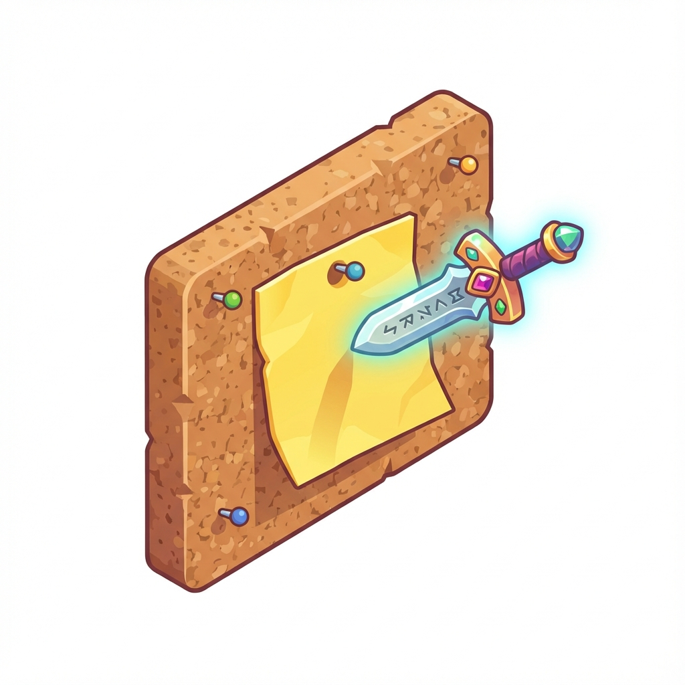

# ⚔️ HomeQuest

> **Turn Chores into Epic Adventures!**

HomeQuest is a gamified chore management application designed to make household tasks fun and rewarding for the whole family. Built with a "demon slayer" inspired aesthetic, it transforms mundane to-do lists into heroic quests.

 *[Logo Placeholder]*

## ✨ Features

- **🛡️ Hero Profiles**: Choose your avatar (Anime Boy, Anime Girl, Boar Mask, Fox Mask) and track your XP.
- **📜 Quest Board**: Accept available quests from the sticky-note board. Flip them to see details!
- **⚔️ Parent Admin Mode**:
    - Secure PIN protection for quest verification.
    - "Pending" status for recurring tasks ensures kids don't just spam click.
- **📱 Tablet Friendly**: Large touch targets and vibrant UI designed for family tablets.
- **💾 Local First**: Data stays on your device. No cloud setup required.

## 🚀 Getting Started

1.  **Clone the repo**:
    ```bash
    git clone https://github.com/yourusername/HomeQuest.git
    ```
2.  **Install dependencies**:
    ```bash
    npm install
    ```
3.  **Start the adventure**:
    ```bash
    npm run dev
    ```

## 🎮 How to Play

1.  **Parents**: Launch the app and set up your **Admin PIN**.
2.  **Create Heroes**: Add profiles for your children.
3.  **Post Quests**: Add chores (Quests) to the board.
4.  **Conquer**: Children log in, accept quests, and mark them as done.
5.  **Verify**: Parents approve the work, and Heroes get their Points!

---

*Built with React, Vite, and a sense of adventure.*
